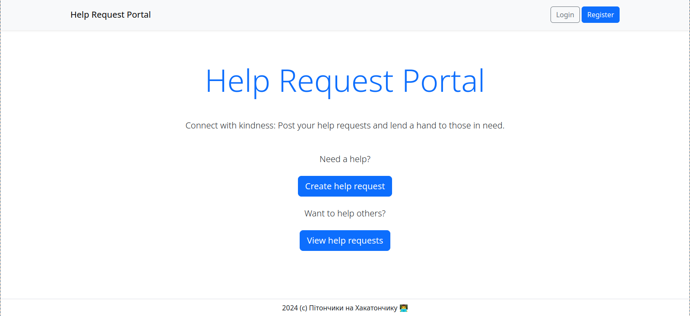

# best-hackathon-test

This portal facilitates the process of providing assistance to people in need, making it easier to connect those who provide help.

> *Connect with kindness: Post your help requests and lend a hand to those in need.*



## Documentation

All the documentation is available on the [http://localhost:8000/docs](http://localhost:8000/docs)

## Development Rules

Run flake8 before pushing

```bash
flake8
```

## Installing using GitHub locally

> **Note**
> For full functionality, you need to provide all variables in .env
>
> See example in [`.env_example`](./.env_example)

1. Clone the repository:

    ```bash
    git clone https://github.com/dkostmii/best-hackathon-test
    ```

2. Change to the project's directory:

    ```bash
    cd best-hackathon-test
    ```

3. Once you're in the desired directory, run the following command to create a virtual environment:

    ```bash
    python -m venv venv
    ```

4. Activate the virtual environment:

    On macOS and Linux:

    ```bash
    source venv/bin/activate
    ```

    On Windows:

    ```bash
    venv\Scripts\activate
    ```

5. Install the dependencies localy

    ```bash
    pip install -r requirements.txt
    ```

6. Create a `.env` file in the root of the project and add the variables, same as in [`.env_example`](./.env_example) file.

7. Run the app

    ```bash
    alembic upgrade head &&
    python3 -m uvicorn app.main:base_app --host 0.0.0.0 --port 8000 --reload
    ```

## Docker

> **Prerequesites**
> Docker should be installed.

1. To build and run the app

    ```bash
    ./utils/up_server.sh build
    ```

2. To run the app:

    ```bash
    ./utils/up_server.sh
    ```

## Database

1. Models already are accessible in [`alembic/env.py`](./alembic/env.py),
thanks to `from database import Base` statement.

2. Create a migration:

    ```bash
    ./utils/create_migration.sh migration_message
    ```

    Migration will up automatically after running the app.

    To downgrade the migration, run:

    ```bash
    ./utils/downgrade_migration.sh
    ```
